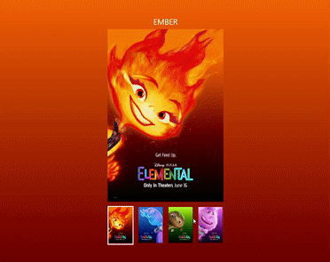

# Elemental Poster 
#### 요구사항
1. 클릭 이벤트 처리
2. li 항목 클릭 시 배경 색상 변경
3. 이미지 변경
4. 이미지에 맞는 텍스트로 변경
5. 함수 분리

<br>

## 결과


<br>

## 설명

 * **배경색 변경 함수**
   * 클릭 이벤트가 발생할 때마다 getNode() 로 받아온 body 부분의 background 컬러를 변경한다.
```js
function setBgColor(index){
  const colorA = data[index-1].color[0];
  const colorB = data[index-1].color[1];
  const posterColor = getNode('body');
  posterColor.style.background = `linear-gradient(to bottom, ${colorA}, ${colorB})`;
}
```

 * **이미지 변경 함수**
   * getNode() 를 통해 visual 클래스 안의 img를 받아와 index 매개변수를 통해 src , alt를 변경한다.
```js
function setImage(index){
const visualImage = getNode('.visual img');
attr(visualImage,'src',`./assets/${data[index -1].name}.jpeg`);
attr(visualImage,'alt',data[index -1].alt);
}
```

 * **텍스트 변경 함수**
   * 매개변수로 받아온 index를 통해 클릭 이벤트가 발생하면 h1의 내용을 받아와 캐릭터 이름을 변경한다..
```js
function setNameText(index){
  const nickName = getNode('.nickName');
  nickName.textContent = `${data[index-1].name}`; 
}
```

 * **오디오 실행 함수**
   * index를 통해 오디오 파일 경로를 설정해주고, audio.js 에서 AudioPlayer 클래스를 가져와 audioPlay.play(); 로 오디오를 실행한다.
```js
function setAudio(index){
const audioSrc = `./assets/audio/${data[index -1].name.toLowerCase()}.m4a`;
console.log(audioSrc);


audioPlay = new AudioPlayer(audioSrc);
audioPlay.play();
}
```

 * **이벤트 핸들러**
   * handleSlider() 는 클릭 이벤트가 발생하면 실행되고, 이벤트 위임을 사용한다.
   * [...nav.children] 를 통해 getNode()로 받아온 ul의 자식요소인 li를 유사배열에서 배열로 변경해주고, forEach()를 통해 li에 'is-active' 클래스를 제거한다.
   * li의 data-index 를 받아와서 각 함수들의 index를 매개변수로 넘겨준다.
```js
function handleSlider(e){
e.preventDefault();
const target = e.target.closest('li');
if(!target ) return;

const nav = getNode('ul');
const list = [...nav.children];

console.log(list);
console.log(navigation);
const index = attr(target,'data-index'); 


list.forEach(li => removeClass(li,'is-active'));
addClass(target, 'is-active'); 


setBgColor(index);
setNameText(index);
setImage(index);
setAudio(index);
  
}
```
